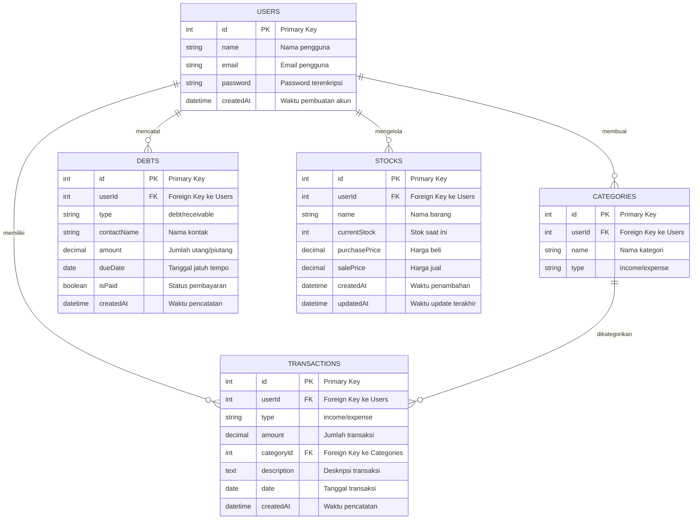

# Entity-Relationship Diagram (ERD) - SmartKas App

## Diagram ERD

## Deskripsi Entitas (Tabel)

### 1. USERS (Pengguna)
Menyimpan informasi dasar pengguna aplikasi SmartKas.

| Field | Tipe | Keterangan |
|-------|------|------------|
| `id` | int (PK) | Primary key, auto increment |
| `name` | string | Nama lengkap pengguna |
| `email` | string | Email unik untuk login |
| `password` | string | Password terenkripsi |
| `createdAt` | datetime | Waktu pembuatan akun |

### 2. TRANSACTIONS (Transaksi)
Menyimpan semua catatan pemasukan dan pengeluaran.

| Field | Tipe | Keterangan |
|-------|------|------------|
| `id` | int (PK) | Primary key, auto increment |
| `userId` | int (FK) | Foreign key ke tabel Users |
| `type` | string | Jenis transaksi: "income" atau "expense" |
| `amount` | decimal | Jumlah uang dalam transaksi |
| `categoryId` | int (FK) | Foreign key ke tabel Categories |
| `description` | text | Deskripsi detail transaksi |
| `date` | date | Tanggal terjadinya transaksi |
| `createdAt` | datetime | Waktu pencatatan transaksi |

### 3. CATEGORIES (Kategori)
Menyimpan daftar kategori yang dibuat pengguna untuk mengklasifikasi transaksi.

| Field | Tipe | Keterangan |
|-------|------|------------|
| `id` | int (PK) | Primary key, auto increment |
| `userId` | int (FK) | Foreign key ke tabel Users |
| `name` | string | Nama kategori (misal: Makanan, Transport) |
| `type` | string | Jenis kategori: "income" atau "expense" |

### 4. DEBTS (Utang/Piutang)
Menyimpan data utang dan piutang pengguna.

| Field | Tipe | Keterangan |
|-------|------|------------|
| `id` | int (PK) | Primary key, auto increment |
| `userId` | int (FK) | Foreign key ke tabel Users |
| `type` | string | Jenis: "debt" (utang) atau "receivable" (piutang) |
| `contactName` | string | Nama orang/pihak terkait |
| `amount` | decimal | Jumlah utang/piutang |
| `dueDate` | date | Tanggal jatuh tempo |
| `isPaid` | boolean | Status pembayaran (true/false) |
| `createdAt` | datetime | Waktu pencatatan |

### 5. STOCKS (Stok Barang)
Menyimpan data barang dan jumlahnya untuk manajemen inventori.

| Field | Tipe | Keterangan |
|-------|------|------------|
| `id` | int (PK) | Primary key, auto increment |
| `userId` | int (FK) | Foreign key ke tabel Users |
| `name` | string | Nama barang |
| `currentStock` | int | Jumlah stok saat ini |
| `purchasePrice` | decimal | Harga beli per unit |
| `salePrice` | decimal | Harga jual per unit |
| `createdAt` | datetime | Waktu penambahan barang |
| `updatedAt` | datetime | Waktu update terakhir |

## Relasi Antar Entitas

### 1. Users ↔ Transactions (1:M)
- **Tipe:** One-to-Many
- **Penjelasan:** Satu pengguna dapat memiliki banyak transaksi
- **Implementasi:** Field `userId` di tabel `TRANSACTIONS` sebagai foreign key

### 2. Users ↔ Categories (1:M)
- **Tipe:** One-to-Many
- **Penjelasan:** Satu pengguna dapat membuat banyak kategori
- **Implementasi:** Field `userId` di tabel `CATEGORIES` sebagai foreign key

### 3. Users ↔ Debts (1:M)
- **Tipe:** One-to-Many
- **Penjelasan:** Satu pengguna dapat memiliki banyak catatan utang/piutang
- **Implementasi:** Field `userId` di tabel `DEBTS` sebagai foreign key

### 4. Users ↔ Stocks (1:M)
- **Tipe:** One-to-Many
- **Penjelasan:** Satu pengguna dapat mengelola banyak item stok
- **Implementasi:** Field `userId` di tabel `STOCKS` sebagai foreign key

### 5. Categories ↔ Transactions (1:M)
- **Tipe:** One-to-Many
- **Penjelasan:** Satu kategori dapat digunakan untuk banyak transaksi
- **Implementasi:** Field `categoryId` di tabel `TRANSACTIONS` sebagai foreign key